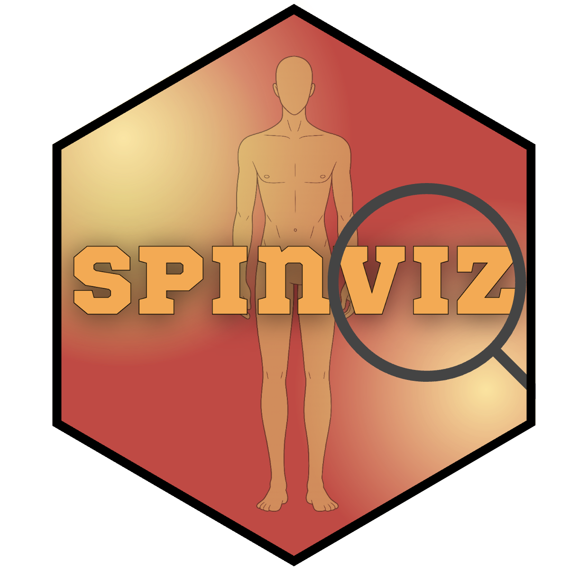
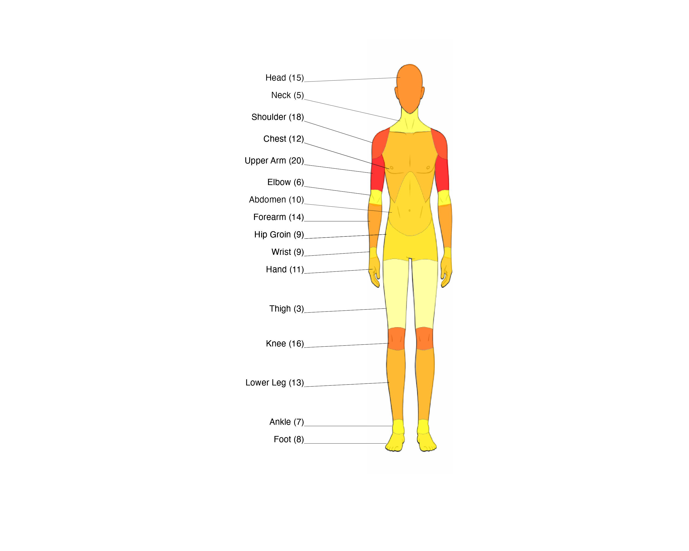

# spinviz<a href = ""></a>

## About

This package is designed to provide easy methods for visualising sporting injuries as defined by the [Olympic Committee](https://pmc.ncbi.nlm.nih.gov/articles/PMC7146946/#T4) in R. The data is expected to follow the formats defined for [body regions and areas](https://pmc.ncbi.nlm.nih.gov/articles/PMC7146946/#T4).

**spinviz** provides tools for visualising sporting injury frequencies as a **heatmap projected onto human-body SVG diagrams** in R.

The main function, `injury_heatmap()`, colours anatomical regions by injury frequency and can render **front**, **back**, or **both** views, using **male** or **female** body templates.

## Examples

**Heatmap diagram**
<details>
<summary><b><code>Example Diagrams</code></b></summary>

|Front (Male)|Back (Male)|Both Views (Male)|
|--|--|--|
|<a href = ""></a>|<a href = ""></a>|<a href = ""></a>|

</details>

## Features

### Injury Heatmap
The heatmap uses **ggplot2** to display a body diagram with regions coloured by injury frequency.

Available options:
- View: `"front"`, `"back"`, or `"both"`
- Diagram sex: `"male"` or `"female"`
- Opacity control
- Optional labels (region names) and/or values
- Optional legend scale
- Custom palettes:
  - Named palettes supported by `diagram_colours()` (viridis or HCL palettes)
  - Or a custom vector of hex colours

## Installation

As this package is not currently on CRAN, install from GitHub:

```r
install.packages("remotes")
remotes::install_github("bnqcasimiro/spinviz")
```

## Getting Started
The available functions in this package are:
- injury_heatmap
- test_colour
- diagram_colours


### Data Format
This package expects data to be provided in a data frame, with columns in the following order:
- Region.area
- Subcategory
- Sport column containing injury frequencies


#### Heatmap Diagram (Body Injuries)
|Region.area|Subcategory|Sport_1
|--|--|--|
|Head and Neck|Head|10
|Head and Neck|Neck|20|
|Upper Limb|Shoulder|5|
|Upper Limb|Upper Arm|8|


### Example Code

#### Heatmap Example
Start by creating a data frame:
```R
Subcategory <- c("Head","Neck","Shoulder","Chest","Upper Arm","Elbow",
                 "Abdomen","Forearm","Hip Groin","Wrist","Hand",
                 "Thigh","Knee","Lower Leg","Ankle","Foot","Thoracic Spine","Lumbosacral")

Region.area <- rep("Example", length(Subcategory))
boxing <- c(15, 5, 18, 12, 20, 6, 10, 14, 9, 9, 11, 3, 16, 13, 7, 8, 18, 22)

df <- data.frame(Region.area, Subcategory, boxing)
```
Then run `injury_heatmap(injury_data, selected_sport, view_choice)` where:
- injury_data: the data to be used, i.e. the data fram above
- selected sport: the column name to use
- view choice: the view of the diagram. One of: "front", "back", "both"

```r
injury_heatmap(df, "boxing", "front", sex = male, show_scale = FALSE)
```
<details>
<summary><b><code>Example Code Run</code></b></summary>
<a href = ""></a>
</details>

run `?injury_heatmap` for more detail.


### Palette Support
You can supply palette as: 
- A palette name supported by diagram_colours() (viridis or HCL), e.g. "magma", "plasma", "Reds" 
- A character vector of hex colours, e.g. c("#FFFFFF", "#FFFF00", "#FF0000")

To preview supported palettes, run
`?diagram_colours` return colours from supported palette names
`?test_colour` visualise palettes (named or custom)


### Dependencies
Key packages used:
- Data wrangling: dplyr, tidyr, rlang, stringr
- SVG handling: xml2
- Iteration/utilities: purrr, magrittr
- Raster + plotting: magick, ggplot2, grDevices
- Combining plots: patchwork
