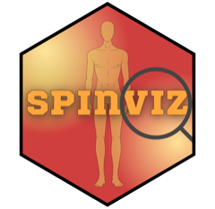
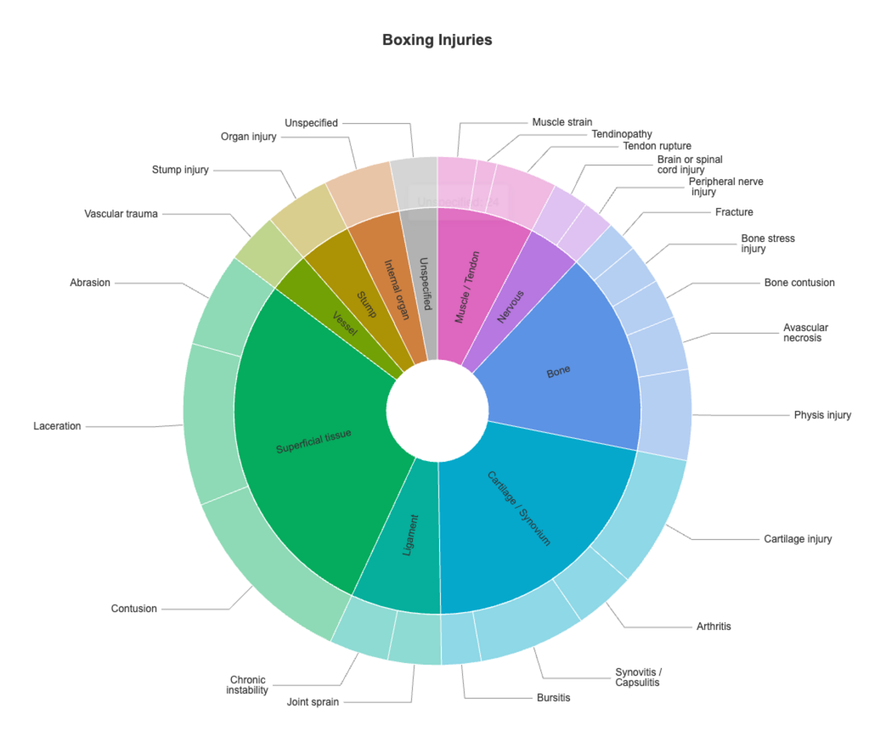

<!-- README.md is generated from README.qmd. Please edit that file -->

# spinviz 

<!-- badges: start -->

[](https://github.com/bnqcasimiro/spinviz/actions/workflows/R-CMD-check.yaml) [](https://deepwiki.com/bnqcasimiro/spinviz) [](https://app.codecov.io/gh/bnqcasimiro/spinviz) <!-- badges: end -->

`spinviz` is an `R` package for visualising **sports injury frequency data**. It renders **anatomical heatmaps** (front/back, male/female body models) and **interactive tissue-type to pathology-type sunburst diagrams**. Toggle labels and values, customise colour palettes and legends, and export publication-ready **PNG, JPG or PDF** figures.

The main function, `heatmap_diagram()`, colours anatomical regions by injury frequency and can render **front**, **back**, or **both** views, using **male** or **female** body templates. `sunburst_diagram_echarts()` renders tissue types on an inner ring and pathologies on an outer ring. Built-in taxonomies (`body_categories`, `injury_categories`), one-call wrappers, and `save_diagram()` for correct-aspect-ratio export are also included.

Full documentation, tutorials, and a function reference live on the [pkgdown site](https://bnqcasimiro.github.io/spinviz/).

## Installation

As this package is not currently on CRAN, install from GitHub:

``` r
# install.packages("pak")
pak::pak("bnqcasimiro/spinviz")
```

## Quick examples

**Heatmap diagram**

``` r
heatmap_diagram(df, "boxing", "front", sex = "male", show_scale = FALSE)
```

<details>

<summary>

<b><code>Example Diagrams</code></b>
</summary>

| Front (Male) | Back (Male) | Both Views (Male) |
|----|----|----|
|  |  |  |

</details>

**Sunburst diagram**

``` r
sunburst_diagram_echarts(df, "boxing", plot_title = "Boxing Injuries")
```

<details>

<summary>

<b><code>Example Diagram</code></b>
</summary>

| Tissue/Pathology Sunburst |
|----|
|  |

</details>

## Learn more

- [Get started](https://bnqcasimiro.github.io/spinviz/articles/spinviz.html) — data format and worked examples
- [Importing data from a CSV file](https://bnqcasimiro.github.io/spinviz/articles/importing-csv-data.html) — template-based CSV workflow
- [Customising and saving diagrams](https://bnqcasimiro.github.io/spinviz/articles/customisation.html) — palettes, display options, and file export
- [Function reference](https://bnqcasimiro.github.io/spinviz/reference/)

## Dependencies

Key packages used:

- Data wrangling: `dplyr`, `tidyr`, `rlang`, `stringr`
- SVG handling: `xml2`
- Iteration/utilities: `purrr`, `magrittr`
- Raster + plotting: `magick`, `ggplot2`, `grDevices`
- Combining plots: `patchwork`
- Interactive sunbursts: `echarts4r`, `htmlwidgets`
- Optional (sunburst file export only): `chromote`, `base64enc`

## Acknowledgements

`spinviz` builds on the foundations laid by the [`injvis`](https://github.com/alexandraD03/injvis-R-Package) and [`olympicinjuRies`](https://github.com/zachary-carr-student/COMP3850) R packages. We thank Alexander Brinkman, Alexandra Dooley, Andisheh Saffarian, Brice Thu, and Utsav Chadha (`injvis`), and Zoe Remo, Brayden Smith, Govardhan Bharadwaj, Katja Amet, Kyle Mcnicholas, and Zachary Carr (`olympicinjuRies`), for their work on those projects, which provided the groundwork for this package.
