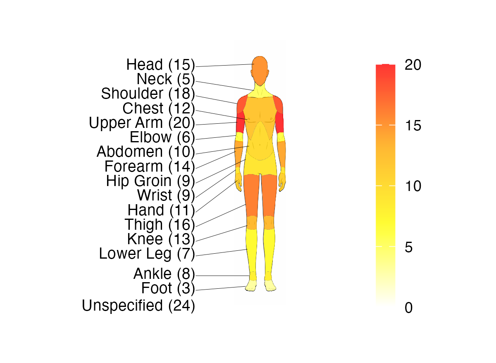
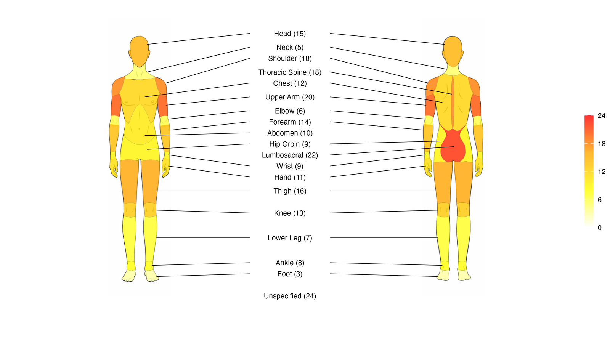

---
format:
  gfm:
    default-image-extension: ""
---

<!-- README.md is generated from README.qmd. Please edit that file -->

```{r}
#| include: false
knitr::opts_chunk$set(
  collapse = TRUE,
  comment = "#>",
  fig.path = "man/figures/README-",
  out.width = "100%"
)
```

# spinviz 

<!-- badges: start -->
[](https://github.com/thomas-fung/spinviz/actions/workflows/R-CMD-check.yaml)
[](https://deepwiki.com/bnqcasimiro/spinviz)
<!-- badges: end -->

## About

The `spinviz` packages provides tools for visualising sporting injury frequencies as a **heatmap projected onto human-body SVG diagrams** in `R`.

The main function, `injury_heatmap()`, colours anatomical regions by injury frequency and can render **front**, **back**, or **both** views, using **male** or **female** body templates.

## Examples

**Heatmap diagram**

<details>
<summary><b><code>Example Diagrams</code></b></summary>

| Front (Male) | Back (Male) | Both Views (Male) |
|---|---|---|
| {height="300"} | {height="300"} | {height="300"} |

</details>

## Features

### Injury Heatmap
The heatmap uses **ggplot2** to display a body diagram with regions coloured by injury frequency.

Available options:

- View: `"front"`, `"back"`, or `"both"`
- Diagram sex: `"male"` or `"female"`
- Opacity control
- Optional labels (region names) and/or values
- Optional legend scale
- Custom palettes:
  - Named palettes supported by `diagram_colours()` (viridis or HCL palettes)
  - Or a custom vector of hex colours

## Installation

As this package is not currently on CRAN, install from GitHub:

```r
# install.packages("pak")
pak::pak("bnqcasimiro/spinviz")
```

## Getting Started
The available functions in this package are:

- `injury_heatmap()`: render injury heatmaps on body SVG diagrams
- `create_injury_template()`: write a template CSV in the expected data format
- `read_injury_data()`: read and validate an injury-data CSV file
- `diagram_colours()`: return colours from supported palette names
- `test_colour()`: visualise palettes (named or custom)

### Data Format
This package expects data to be provided in a data frame, with columns in the following order:

- Region.area
- Subcategory
- Sport column containing injury frequencies

#### Heatmap Diagram (Body Injuries)

|Region.area|Subcategory|Sport_1|
|--|--|--|
|Head and Neck|Head|10|
|Head and Neck|Neck|20|
|Upper Limb|Shoulder|5|
|Upper Limb|Upper Arm|8|

### Importing Data from a CSV File

If your injury data lives in a CSV file, the package provides helpers for the full workflow: create a template, fill it in, read it back, and plot.

**1. Create a template CSV** with all 18 recognised body subcategories and one empty column per sport:

```{r}
#| label: csv-template
#| eval: false
create_injury_template("injuries.csv", sports = c("boxing", "judo"))
```

**2. Fill in the file** in your favourite spreadsheet editor, entering the injury frequencies and the `Region.area` grouping for each row.

**3. Read the file back in.** `read_injury_data()` checks that the required columns are present, that at least one sport column exists, and that sport values are numeric (with a warning for values that fail to parse):

```{r}
#| label: csv-read
#| eval: false
df <- read_injury_data("injuries.csv")
```

**4. Plot as usual:**

```{r}
#| label: csv-plot
#| eval: false
injury_heatmap(df, "boxing", "front", sex = "male")
```

### Example Code

#### Heatmap Example
Start by creating a data frame:

```{r}
#| label: example-data
#| eval: false
Subcategory <- c("Head","Neck","Shoulder","Chest","Upper Arm","Elbow",
                 "Abdomen","Forearm","Hip Groin","Wrist","Hand",
                 "Thigh","Knee","Lower Leg","Ankle","Foot","Thoracic Spine","Lumbosacral")

Region.area <- rep("Example", length(Subcategory))
boxing <- c(15, 5, 18, 12, 20, 6, 10, 14, 9, 9, 11, 3, 16, 13, 7, 8, 18, 22)

df <- data.frame(Region.area, Subcategory, boxing)
```

Then run `injury_heatmap(injury_data, selected_sport, view_choice)` where:

- `injury_data`: the data to be used, i.e. the data frame above
- `selected_sport`: the column name to use
- `view_choice`: the view of the diagram. One of: `"front"`, `"back"`, `"both"`

```{r}
#| label: example-heatmap
#| eval: false
injury_heatmap(df, "boxing", "front", sex = "male", show_scale = FALSE)
```

<details>
<summary><b><code>Example Code Run</code></b></summary>
{height="600"}
</details>

Run `?injury_heatmap` for more detail.

### Palette Support
You can supply palette as:

- A palette name supported by `diagram_colours()` (viridis or HCL), e.g. `"magma"`, `"plasma"`, `"Reds"`
- A character vector of hex colours, e.g. `c("#FFFFFF", "#FFFF00", "#FF0000")`

To preview supported palettes, run `?diagram_colours` and `?test_colour`.

### Dependencies
Key packages used:

- Data wrangling: `dplyr`, `tidyr`, `rlang`, `stringr`
- SVG handling: xml2
- Iteration/utilities: `purrr`, `magrittr`
- Raster + plotting: `magick`, `ggplot2`, `grDevices`
- Combining plots: `patchwork`
